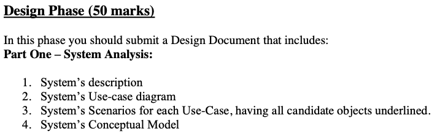

# 614-Final-Project
## Folder Structure 
- **Design Phase:** In-progress design work.
- **Implementation Phase:** In-progress implementation work. 
- **Final Submission:** Completed work (Ideally, once a file is added, it will not be touched until final review for submission)
- **miscellaneous:** Extra files for future reference.
## Naming Convention 

**Example:** If you are working on part 1 #2, add the file in sub-folder "Part 1" within folder "Design Phase" and name it "2-System use case diagram". 
